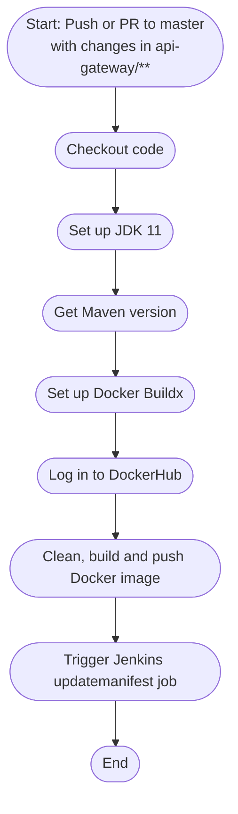
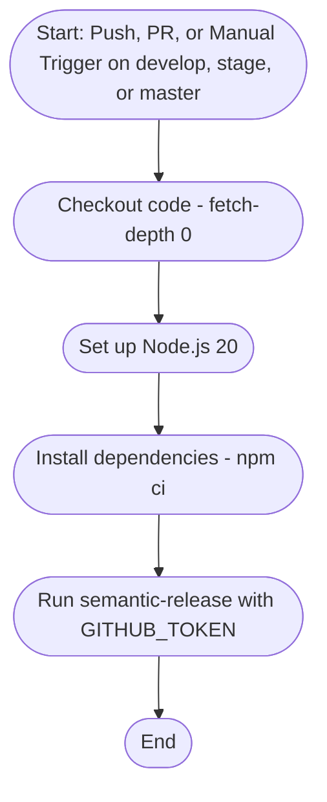
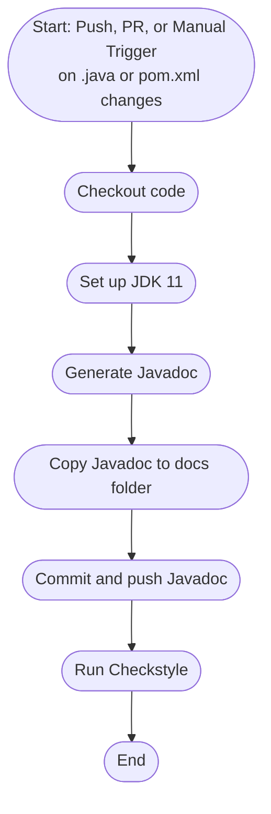
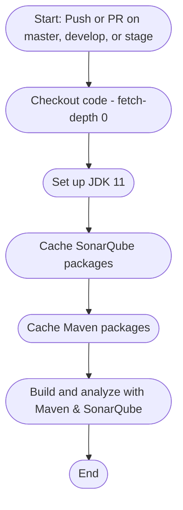
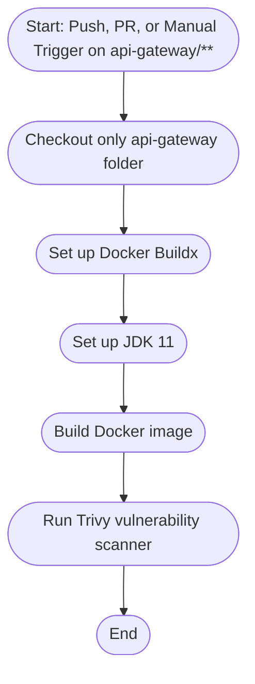

# e-Commerce Microservice Backend App

Hi, welcom, this is the main file for my last (hopefully) university project. This project was done by  [Vanesa Ramos](https://github.com/Vanesa155) and [Felipe Barreto](https://github.com/FelipeBarretoB) for the automation subject. 

This project was based in an already existing project, which you can find [here](https://github.com/SelimHorri/ecommerce-microservice-backend-app). Both the front and back were already developed, however we had to change a lot of things just to make it work. Because this is an automation/DevOps project, we just got it to a point where it could stand and then develop the automation parts.

As this is the biggest repository, heres the links to all the other repositories:
- [ecommerce-frontend](https://github.com/FelipeBarretoB/ecommerce-frontend-web-app)
- [ecommerce-kubernetes-manifest](https://github.com/FelipeBarretoB/ecommerce-kubernetes-manifest)
- [ecommerce-infrastructure](https://github.com/FelipeBarretoB/ecommerce-infra)
- [ecommerce-qa](https://github.com/FelipeBarretoB/ecommerce-qa)

This app was deployed in AKS (Azure Kubernetes Service) and is integrated with a lot of other tools, such as:
- **GitHub Actions**: For most CI/CD pipelines.
- **DockerHub**: To store and pull images.
- **Kubernetes**: For orchestration and deployment.
- **ArgoCD**: For continuous delivery and deployment.
- **sonarcloud**: For code quality and security analysis.
- **Prometheus & Grafana**: For monitoring and alerting.
- **jenkins**: For GitOps.
- **jmeter**: For performance testing.

And a lot others

You can read the old readme for the original project [here](README_old.md).

---

## Table of Contents

- [Architecture](#architecture)
- [Services](#services)
- [Getting Started](#getting-started)
- [Development](#development)
- [Deployment](#deployment)
- [Database](#database)
- [Pipelines](#pipelines)
  - [Building images pipelines](#building-images-pipelines)
  - [Changelog pipelines](#changelog-pipelines)
  - [Checkstyle and Javadoc pipelines](#checkstyle-and-javadoc-pipelines)
  - [SonarCloud pipeline](#sonarcloud-pipeline)
  - [Trivy pipelines](#trivy-pipelines)

---

## Architecture

The system follows a microservices architecture, with each service responsible for a specific business domain. The main components are:

- **API Gateway**: Entry point for all client requests, routing and securing traffic.
- **Service Discovery**: Eureka-based registry for dynamic service lookup.
- **Cloud Config**: Centralized configuration management for all services.
- **User Service**: Manages users and authentication.
- **Product Service**: Handles products and categories.
- **Order Service**: Manages orders and carts.
- **Favourite Service**: Manages user favourites.
- **Shipping Service**: Handles shipping logistics.
- **Payment Service**: Processes payments.
- **Proxy Client**: Handles authentication and authorization.
- **Zipkin**: Distributed tracing (optional).

---

## Services

Each service is located in its own directory:

- `api-gateway/`
- `cloud-config/`
- `favourite-service/`
- `order-service/`
- `payment-service/`
- `product-service/`
- `proxy-client/`
- `service-discovery/`
- `shipping-service/`
- `user-service/`

---

## Getting Started

To run the application as we did you'll need to make sure you add the secrets used in the pipelines.

My recomendations is that you do as such, run the terraform infractructure, then the ansible to install argoCD, then apply the applicationsets for both argos and that should be enough to get you started.

Again, make sure you have the secrets set up in your GitHub repository, otherwise the pipelines will fail

---

## Notes

### Prerequisites

- Java 11+
- Maven
- Docker
- Kubernetes (Minikube, Docker Desktop, or a cloud provider)
- MySQL

### Building images

BEFORE BUILDING AN IMAGE, ensure to run the following command to build the project and generate the necessary artifacts:

```sh
./mvnw clean package
```
If you don't run the command, eureka might not work properly.


Example to build image for `order-service`:
```sh
docker build -t your-dockerhub/order-service:latest ./order-service
docker push your-dockerhub/order-service:latest
```
Repeat for each service.


---

### Database

- Uses MySQL for persistent storage.
- Database migrations are managed with Flyway.
- See each service's `application.yml` for DB configuration.
- Dev profile uses an in-memory H2 database for testing.
- Production profile uses MySQL

---


### pipelines

This are all github actions pipelines, you can see the results of the pipelines in the actions tab of the repository.

#### Building images pipelines

This pipelines are responsible for building the images and pushing them to DockerHub. They are triggered by a push to the main branch or a pull request.

They also trigger a jenkins pipeline who is responsible for testing the manifest is correct, and adding the new image to the manifest.

There is one pipeline for each service, and they are located in the `.github/workflows` directory.

example of one of this pipelines:



#### Chanelog pipelines
This pipelines are responsible for generating the changelog and pushing it to the `CHANGELOG.md` file. 

This is done by using semantic release, which is a tool that generates the changelog based on the commit messages.

it also generates tags and is pretty useful to keep track of the changes made in the project.

It also adds the version to the pom file, however, be careful with this, as if not done correctly it will only update the parent pom file, and not the child poms, which will cause problems when building the images.

the configuration file for sematic realease is located in the `.releaserc` file.

here is the pipeline: 



#### checkstyle and javadoc pipelines
This pipelines are responsible for checking the code style and generating the javadoc for the project. They are triggered when there are changes to java or pom files in the repository.

This pipeline will fail, as we said, we did this from a DevOps perspective and not from a development perspective, so we didn't care about the code style or the javadoc, however, you can run the pipeline locally to check the code style and generate the javadoc to inform a future developer about the code. 

This is why the pipeline fails, because it will find a lot of code style issues and no javadoc specific javadoc. However, this does create the skeleton for the javadoc, and you can find it in the `/doc` folder.

Heres is the pipeline:


the checkstyle (and many other pipelines here) use a flag that prevents the pipeline from stopping after the first error, in this case de `-fae` flag, this is done so that we can see all the errors in the code style and fix them all at once, instead of fixing one and then running the pipeline again to see the next one.

#### SonarCloud pipeline
This pipeline is responsible for running the SonarCloud analysis on the project. It is triggered by a push to the main, stage or develop branch or a pull request.

it analyzes all of the microservices persent in the repository, and generates a report with the code quality and security issues found in the code.

Remember for this pipeline to work, you need to have the `SONAR_TOKEN` secret set in your GitHub repository.

This also uses a flag that prevents the pipeline from stopping after the first error. We also configured a quality gate in SonarCloud, so if the code quality is below a certain threshold, the pipeline will fail.

BE WARNED, the k8 repository has a scale up and scale down function, after 11pm -5 UTC the repository will scale down to 0 pods, so if you run the pipeline after that time, it will fail because the pods will not be running.
It will scale up again at 4am -5 UTC, so you can run the pipeline again at that time.

If you don't want this function, disable or delete the pipelines in the k8 repository.

heres the pipeline:



#### Trivy pipelines
this pipeline builds a local docker image and then runs trivy against it to check for vulnerabilities. Like the build image pipelines, this is triggered when there is a change to that service.

Again, this pipeline will fail, and it has a flag that prevents it from stopping after the first error, so you can see all the vulnerabilities found in the image.

here is the pipeline:


---